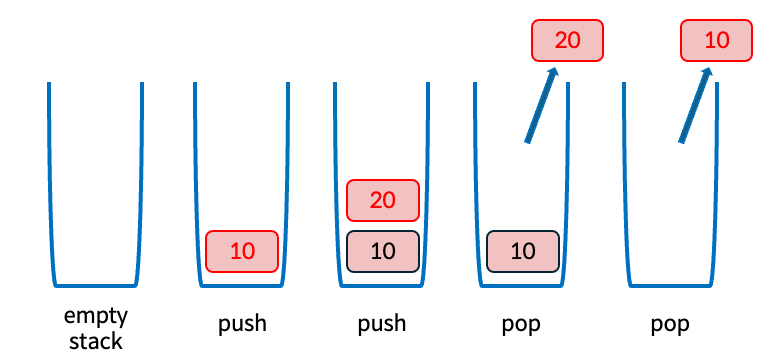

## Stack (스택)

스택(Stack)은 **후입선출(LIFO: Last-In First-Out)** 원칙을 따르는 대표적인 선형 자료구조이다.  
즉, 가장 나중에 삽입된 데이터가 가장 먼저 제거되는 구조를 가진다.

스택에서 데이터의 **삽입(push)** 과 **삭제(pop)** 는  
오직 한쪽 끝에서만 수행되며, 이 위치를 **top**이라고 한다.

이러한 제약으로 인해 스택은  
**접근 제한 자료구조(Restricted Access Data Structure)** 로 분류된다.

---

### 직관적 이해 (Intuitive View)

스택은 접시를 차곡차곡 쌓아 올린 구조와 유사하다.

- 새로운 데이터는 항상 맨 위에 추가된다  
  → push
- 데이터 제거 또한 맨 위에서만 가능하다  
  → pop
- 중간에 위치한 데이터에는 직접 접근할 수 없다

이와 같은 특성 때문에 스택은  
**순차적인 처리 흐름을 관리하는 데 매우 적합**하다.

---

### 스택 동작 예시

위 그림은 스택에서 `push`와 `pop` 연산이 수행되는 과정을 순서대로 나타낸 것이다.

1. **empty stack**  
   스택이 비어 있는 초기 상태이다.

2. **push(10)**  
   값 `10`이 스택에 삽입되며, `10`이 top이 된다.

3. **push(20)**  
   값 `20`이 기존 데이터 위에 추가되고, top은 `20`을 가리킨다.

4. **pop()**  
   가장 최근에 삽입된 값 `20`이 제거되고 반환된다.

5. **pop()**  
   다음으로 top에 있던 값 `10`이 제거되어 스택은 다시 빈 상태가 된다.

---
### Stack ADT (Abstract Data Type)

스택은 구현 방식과 무관하게, 다음과 같은 연산을 제공하는  
**추상 자료형(ADT)** 으로 정의된다.

| 연산 | 설명 |
|----|----|
| `push(x)` | 스택의 top 위치에 원소 `x`를 삽입 |
| `pop()` | top 원소를 제거하고 그 값을 반환 |
| `peek()` | top 원소를 반환 (스택 상태는 변경하지 않음) |
| `isEmpty()` | 스택이 비어 있는지 여부를 반환 |

> ADT는  
> **자료구조가 제공해야 할 기능만을 정의**하며,  
> 실제 구현 방식(배열, 연결 리스트 등)과는 독립적이다.

---

### 배열 기반 스택 구조 (Array-Based Stack)

본 실습에서는  
**고정 크기 배열**을 사용하여 스택을 구현한다.

- 배열은 스택의 실제 데이터를 저장한다.
- `top` 변수는 현재 스택의 마지막 원소 위치를 가리킨다.
- 스택이 비어 있는 초기 상태에서는  
  `top = -1`로 설정한다.
